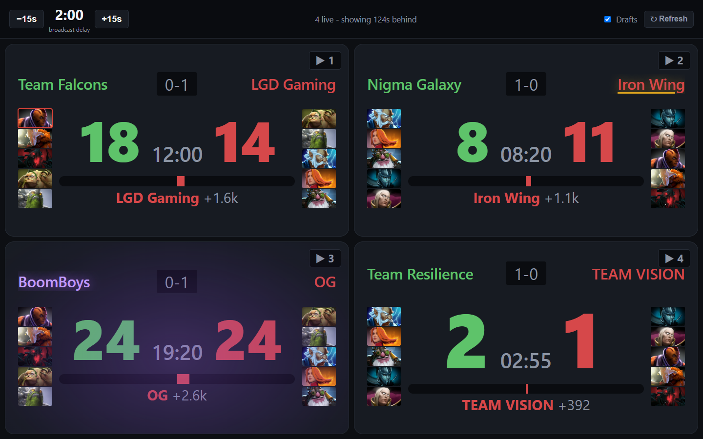

# raspi_watch — TI viewing setup

Watch the TI streams with a live scoreboard that does **not** spoil fights before
you see them, and switch the main screen between games by tapping them on a
second screen.

Everything below runs on **this Windows box**. The Mac plays one permanent stream
on the TV/projector and nothing here touches it.

| Piece | Runs on | Shows |
|---|---|---|
| **Main stream** | the Mac → TV/projector | one stream, started by hand. Not driven by this repo. |
| **Viewer** (`/viewer`) | this box → main screen | whichever game you clicked, switched instantly |
| **Scoreboard** (`/`) | this box → small table screen | live scores for every game, held behind the broadcast |

TI 2026 group stage: **Aug 13–16**. Main event: **Aug 20–23**.



Four games, `Drafts` on, and the three things worth looking up for, one per tile:

| Tile | Mark | Means |
|---|---|---|
| Team Falcons vs LGD | red outline on a hero portrait | that hero is carrying a **Divine Rapier** |
| Nigma Galaxy vs Iron Wing | gold underline on a team name | that team holds the **Aegis** |
| BoomBoys vs OG | purple haze, purple team name | that team just used a **Smoke of Deceit** |
| Team Resilience vs TEAM VISION | nothing | an ordinary game, for contrast |

The `2:00` top-left is the spoiler guard: every tile is showing the game as it
was two minutes ago, which is where the broadcast is. The marks obey it too — a
border lights up when the item reaches *your* screen, not when Valve's API sees
it, so an alert cannot spoil the moment it exists to announce.

That is `--demo`, so the scores are invented; the layout, the marks and the
delay are the real thing:

```powershell
.\scripts\start_all.ps1 -Restart -Demo
```

---

## The one thing to understand

Valve's API is **live**. The broadcast is **2–5 minutes behind it**. Render the API
directly and the scoreboard tells you about a teamfight before you watch it.

So the scoreboard buffers every poll and shows you the state from `N` seconds ago.

**`N` is set automatically.** Valve reports the broadcast delay per game in
`stream_delay_s`, and the page adopts it — the readout says "from Valve" when it
does. Observed values in the wild are 10, 120 and 300 seconds, so guessing a
fixed number would have been wrong most of the time. Where several games
disagree, the largest wins: showing data older than necessary is harmless,
showing it too early is the one thing this exists to prevent.

The `−15s` / `+15s` buttons still override it, and your choice is remembered.
If the broadcast you're watching adds its own delay on top of Valve's, nudge it
until a kill on screen and the tile ticking over happen together.

---

## Each morning of the event

YouTube's four concurrent TI streams are four separate video IDs on one channel,
and **they change every day**. The `@channel/live` URL only ever resolves to one
of them, and cannot be embedded at all. So:

```powershell
python wall\find_streams.py --write    # writes the four English streams itself
```

Then press **`R`** on the viewer. That is the whole routine — no restart, and
nothing edited by hand.

`--write` picks the four **English** streams by their `[EN-A]`..`[EN-D]` title
prefix, because yt-dlp returns every language in no useful order and "the first
four" is a mix of English, Russian and Chinese. It replaces only the two arrays,
leaves the rest of the file alone, and validates the result before writing —
editing this file by hand broke it twice, and a malformed `streams.toml` shows
up on screen as "no streams configured", which points nowhere near the mistake.

Without `--write` it prints the blocks for you to paste instead, and `--twitch`
probes the Twitch channel names.

**YouTube is the configured path, not Twitch.** Twitch injects ads into the
stream itself, so no client can strip them. The cost is this daily hunt —
Twitch's channel names (`dota2ti`, `dota2ti_2`, `dota2ti_3`, `dota2ti_4`, plus
`_cn` / `_ru` / `_es` variants) are stable for the whole event and are kept in
`streams.toml` as a fallback.

---

## Setup

```powershell
pip install -r requirements.txt
```

Put a free key from <https://steamcommunity.com/dev/apikey> into `config.toml`,
or set `STEAM_API_KEY` in the environment (which wins over the file).

Find TI's league id once it's live, and paste it into `config.toml`:

```powershell
python scripts\find_league.py
```

## Running it

```powershell
.\scripts\start_all.ps1            # server + both screens
.\scripts\start_all.ps1 -Restart   # kill what's running first
.\scripts\start_all.ps1 -Demo      # invented games, for testing the clicks
```

**It checks the pages actually loaded, and that check matters.** A browser
window can open, look entirely correct, and never load the page -- which
happened repeatedly during TI's first round and is indistinguishable from a
working screen until you try to use it. So the script counts requests: a live
viewer polls about twice a second, a live scoreboard once every three. It prints
OK or NOT LOADING for each rather than leaving you to find out mid-match.

The two halves can still be run separately:

```powershell
.\scripts\open_scoreboard.ps1   # starts the server, opens the scoreboard on the small screen
.\scripts\open_viewer.ps1       # opens the viewer fullscreen on the main screen
```

`open_scoreboard.ps1` takes the secondary display, `open_viewer.ps1` takes the
primary. Pass `-Display 2` to the viewer if it guesses wrong, and `-NoServer` to
the scoreboard if the server is already up. Fullscreen matters on the small
screen: in a normal window the taskbar clips the bottom row of tiles.

Browser preference is Brave, then Edge, then Chrome — all Chromium, so the flags
are identical. Override with `-Browser "C:\path\to\browser.exe"`.

To run the server alone:

```powershell
python -m scoreboard.server
```

It binds `0.0.0.0`, so a phone on the same network works too — and different
viewers can run different delays, since the delay is a per-client setting.

---

## Click a game to change the main screen

Tap a game on the table screen and the main screen switches to that game's
stream. The switch is instant: **every configured stream is loaded and playing
from the moment the viewer opens**, muted and stacked behind the visible one, so
selecting one is a change of which is on top rather than a load. That is the
whole reason for doing this instead of opening a link — and the reason four
streams are decoding at once.

The tile currently on the main screen is outlined, and the `▶ n` badge says which
stream each game is on.

**About that badge:** nothing in Valve's data says which stream is showing which
match — no field connects a Twitch/YouTube URL to a `match_id`. So the mapping
cannot be derived, only stated. It defaults to screen position, which is correct
whenever `wall/streams.toml` is ordered the same way as the scoreboard. When it
isn't, click the badge to cycle it; your choice is remembered per match.

### Drift, and the `L` key

Preloading is what makes switching instant, and drift is its price. A player
sitting behind the visible one stalls and recovers over an evening, and each
recovery resumes where it left off rather than catching up -- so a stream you
switch to can be minutes behind the one you were watching. That also quietly
invalidates the delay you tuned on the scoreboard, since the delay is relative
to what is on screen.

Switching now snaps that stream to the live edge on its way in. `L` (or the
button) does it to all four at once, which is what you want after leaving the
viewer running through a long break.

This is deliberately not done on a timer: seeking makes a player rebuffer, and a
background timer doing that would occasionally stall the exact stream you were
about to switch to -- reintroducing the pause preloading exists to avoid.

Measured on this box during round 1: four concurrent 1080p streams cost about
**11% of a 16-core CPU**, so drift here is not the machine struggling to decode.
It is how live players behave.

### If the viewer shows "Sign in to confirm you're not a bot"

That is YouTube, not us. The viewer runs in its own profile with no cookies and
no history, then opens four live embeds at once — a fair description of a bot.

Fix it once:

```powershell
.\scripts\youtube_signin.ps1     # opens that profile as a normal window
# sign in to YouTube, close the window, then:
.\scripts\start_all.ps1 -Restart
```

It persists, because the profile directory survives restarts. Deleting
`%LOCALAPPDATA%	i_viewer_profile` undoes it.

If that does not clear it, fall back to Twitch, which has no bot check and whose
TI channel names are stable for the whole event:

```powershell
python wallind_streams.py --twitch --write
```

Then press `R`. The cost is ads baked into the stream, which no client can
strip, and no titles — so games map to streams by position and a wrong one needs
a badge click.

### Sound

The viewer starts **silent**, and there is nothing to fix: browsers only allow
autoplay when muted, and only a click on the viewer window itself can turn sound
on. So it asks once — click anywhere on the main screen — and from then on audio
follows whatever you click on the scoreboard.

Set the Mac's volume by hand to whatever you want alongside it. Nothing
coordinates the two.

### Viewer keys

| Key | Button | Does |
|---|---|---|
| `1`–`4` | — | show that stream directly, without the scoreboard |
| `M` | top-right | mute / unmute |
| `L` | top-right | jump every stream to the live edge |
| `R` | top-right | re-read `streams.toml` and rebuild the players |
| `F` | — | toggle fullscreen |

The buttons appear top-right when the mouse moves. They exist because the keys
need that window focused, and the viewer normally sits on the screen you are not
typing at.

### On the scoreboard

- `−15s` / `+15s` adjust the delay (persisted in the browser)
- `Drafts` toggles hero portraits — off by default, since 40 icons is too dense
  on a small screen
- `↻ Refresh` clears this browser's saved delay and draft settings and reloads
  bypassing the cache. Use it if the delay looks wrong (it's remembered across
  sessions, so an old value can linger) or the page has been open for days
- The status line says `warming up` while there's less than `N` seconds of
  history, and `STALE` if Valve's API stops responding. It never silently shows
  fresher data than you asked for, and never blanks a tile — the last good
  snapshot stays up.

### Layout

Scoreboard tiles are laid out by game count: 1 game fills the screen, 2–4 go in
a 2x2, more spill into three columns. Four is the TI group-stage case and is what
the sizing is tuned for. Verified on a 1440x900 secondary display.

### If the viewer shows nothing

The page builds its players once at load. If that fails, it stays up but deaf to
the scoreboard, which looks like "clicking does nothing" rather than an error.

The quickest check is the server log: a working page sends about 20
`GET /api/viewer` per 10 seconds. Zero means the page never finished starting.

The known cause was YouTube's `iframe_api` script being blocked by Brave
Shields, which is why the viewer now drives the embeds over `postMessage` with
no third-party script at all. If it ever recurs, suspect Shields blocking the
embed frames themselves, and turn Shields down for `localhost` in the viewer's
own Brave profile.

### If a stream slot is empty

An unconfigured or unembeddable entry in `streams.toml` shows a labelled dark
panel rather than failing, so it is obvious which of the four needs an ID. A
broken `streams.toml` never stops the scoreboard from starting — the scores
matter more than the video.

---

## Optional: the 2x2 wall on the Mac

`wall/wall.py` tiles four streams 2x2 on the Mac with instant audio switching.
It is **not part of the setup above** and nothing drives it remotely; it's kept
as the fallback if you'd rather have the four-up wall on the projector than one
stream. Run it in a Terminal on the Mac (hotkeys need a real terminal, and the
windows need a real desktop session — a plain non-interactive ssh command won't
do):

```sh
brew install mpv yt-dlp streamlink        # one-time
cd ~/raspi_watch && /usr/local/bin/python3.12 wall/wall.py
```

Keys: `1`–`4` move audio, `5` fullscreens the tile with audio, `r` respawns dead
tiles, `q` quits. Flags: `--list-displays`, `--dry-run`, `--screen N`.

Notes, all learned the hard way:

- **Use `/usr/local/bin/python3.12`.** The Mac's default `python3` is 3.7, which
  has no `tomllib`.
- Display auto-detection prefers an **external** display over the MacBook's own
  panel. Retina panels are converted to logical points — using their advertised
  pixel count puts three of the four tiles off-screen.
- YouTube tiles pass `--ytdl-raw-options=no-live-from-start=` so they open at
  the live edge. The opposite spelling makes yt-dlp build an EDL of DVR
  segments that mpv cannot open, and every tile dies ~4s in and respawns
  forever.
- macOS **display mirroring** collapses the panel and the TV into a single
  screen, so `--screen=1` stops existing. The wall detects this and falls back
  to `--screen=0`; use Extended Display to drive the TV on its own.
- Fans too loud? Measured on 2026-08-11: four tiles hold the Mac at a 29–41%
  `CPU_Speed_Limit`, and **720p does not help** — same floor, it just takes ~4
  minutes to get there instead of under 1. It runs fine throttled (0 respawns,
  0 dropped frames over 47 minutes). If you change quality anyway, YouTube tiles
  read `ytdl_format` and Twitch tiles read `quality`.

---

## Tests

```powershell
python -m pytest tests/ -q     # 102 tests, no network needed
```

Everything is tested against a recorded fixture, including the cases that
actually break parsers during a real tournament: a game mid-draft with no
`scoreboard` key, and a team with no registered name.

What tests can't cover, both needing the live event and a browser:

1. Dialling the delay to match the broadcast.
2. That switching is actually seamless — that the hidden players keep buffering
   and the swap shows no black frame. Browser autoplay and throttling behaviour
   can only be confirmed on the real thing.

---

## Layout

```
scoreboard/
  delay.py       the spoiler guard — time-indexed snapshot buffer
  models.py      normalizes Valve's payload; the seam for an OpenDota fallback
  source.py      Valve Web API client
  heroes.py      hero_id -> name/icon, cached to disk
  streams.py     streams.toml -> embeddable video IDs for the viewer
  server.py      Flask app + background poller + the viewer selection
  static/        the scoreboard and the viewer (no build step, no framework)
wall/
  streams.toml   the four streams (read by the viewer AND the optional wall)
  find_streams.py  the daily stream-ID hunt — run this on Windows
  wall.py        the optional 2x2 Mac wall
scripts/
  find_league.py       discover TI's league id
  open_scoreboard.ps1  scoreboard, fullscreen, second screen
  open_viewer.ps1      viewer, fullscreen, main screen
  sync_to_mac.ps1      push to the Mac (only needed for the optional wall)
```

## Why the Pi isn't in this

A Pi 3B has 1GB of RAM and one VideoCore IV decode path — about one 480–720p
stream, never four. The scoreboard is deliberately a plain web app with no build
step and no framework, so it can move to the Pi later (silent, always-on) with no
code changes. That's why the project keeps the name.
